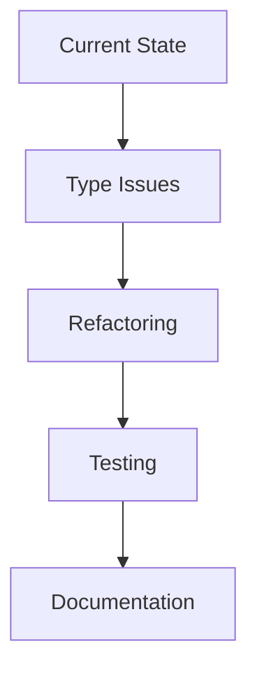
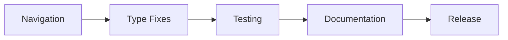

# Active Context: GroundLink (Drone Control System)

## Translation Pattern
When adding user-facing text to the system, always follow these steps:
1. Add both English and Ukrainian translations in src/constants/translations.ts
2. Use the t() function to display translated text
3. For status messages, create generic translations that can be reused (e.g., "Connected"/"Підключено")

## Current Focus Areas

### Navigation System Improvements
- Implemented responsive menu system with Pinia store
- Updated status indicators placement and styling with v-chips
- Enhanced UI/UX for mobile adaptability
- Added translations for connection states

### TypeScript Type System Improvements
- Addressing type issues in video settings implementation
- Resolving BaseVideoSettings array type mismatches
- Fixing property 'labe' typo in video settings

### Code Quality


## Recent Changes

### Navigation System Update
1. **Menu Store Implementation**
   - Created Pinia store for menu state
   - Implemented auto-collapse functionality
   - Added manual toggle with menu button

2. **Component Updates**
   - Moved status indicators to top bar
   - Refactored status indicators to use v-chips with Material icons
   - Updated status messages with proper translations
   - Added responsive video controls
   - Updated navigation icons and tooltips

3. **UI/UX Improvements**
   - Enhanced menu transitions
   - Added icon-only view in collapsed state
   - Improved mobile responsiveness
   - Updated status indicators with clear text and icons

### Version 1.8.4-all
- Fixed settings page scroll functionality
- Added hidden scrollbar implementation
- Improved settings page UI/UX

### Components Under Active Development
1. **Navigation System**
   - Menu collapse functionality
   - Status indicator placement and styling
   - Mobile responsiveness

2. **Video Settings Container**
   - Improving type safety
   - Enhancing configuration options
   - Optimizing performance

3. **Connection Settings**
   - Added type safety improvements
   - Enhanced error handling for ID validation
   - Improved code organization and readability

4. **Vulik Control Page**
   - Refining state management
   - Improving error handling
   - Enhancing user feedback

5. **API Controllers**
   - Standardizing error responses
   - Improving type definitions
   - Optimizing network requests

## Active Decisions

### Navigation Implementation
1. **Menu State Management**
   ```typescript
   // Centralized menu state using Pinia:
   const useMenuStore = defineStore("menu", () => {
     const isCollapsed = ref(window.innerWidth < 1000);
     const isManualCollapse = ref(false);
     // ... state and actions
   });
   ```

2. **Responsive Design**
   - Auto-collapse below 1000px
   - Manual toggle with menu button
   - Icon-based navigation in collapsed state

### Type System Enhancement
1. **Current Issue**
   ```typescript
   // Need to resolve BaseVideoSettings interface issues:
   type BaseVideoSettings = {
     label: string;    // Required
     format: string;   // Required
     width: number;    // Required
     height: number;   // Required
     bitrate: number;  // Required
     fps: number;      // Required
   }
   ```

2. **Proposed Solution**
   - Enforce strict type checking
   - Remove optional properties
   - Fix property naming ('labe' → 'label')
   - Update all implementations

### Architecture Decisions
1. **State Management**
   - Centralizing application state with Pinia
   - Implementing proper reactivity
   - Optimizing store access

2. **Video Stream Handling**
   - Using RTP for efficient streaming
   - Implementing quality adaptation
   - Managing device compatibility

3. **Control System**
   - Maintaining low latency
   - Ensuring command reliability
   - Improving error recovery

## Next Steps

### Immediate Tasks
1. Monitor and refine navigation system:
   - Test menu behavior across devices
   - Verify status indicator visibility
   - Optimize transitions and animations

2. Fix TypeScript errors in:
   - video-settings.ts
   - rpanion.ts

3. Improve Video Settings:
   - Validate configuration options
   - Add error boundaries
   - Enhance performance

4. Enhance Vulik Control:
   - Add loading states
   - Improve error handling
   - Optimize state updates

### Planned Improvements


## Active Considerations

### Performance
- Monitor video stream latency
- Optimize state updates
- Reduce network overhead
- Menu transition smoothness

### Reliability
- Improve error recovery
- Enhance connection stability
- Strengthen validation
- Menu state persistence

### User Experience
- Clear navigation feedback
- Menu transition smoothness
- Clearer error messages with proper translations
- Improved feedback

## Known Issues

### Type System
```typescript
// video-settings.ts
- Property 'labe' issue
- BaseVideoSettings array type mismatch

// rpanion.ts
- Undefined label property
- Type conversion errors
```

### Network
- Connection recovery optimization needed
- VPN reconnection handling improvements
- Stream quality adaptation refinement

### UI/UX
- Loading state indicators needed
- Error message clarity
- Status feedback improvements

## Monitoring Points

### System Health
- Navigation responsiveness
- Video stream performance
- Control system latency
- Network connection stability

### Error Patterns
- Connection failures
- Type mismatches
- State inconsistencies
- Menu state synchronization

### User Feedback
- Menu usability on different devices
- Error message clarity
- Operation success rates
- Interface responsiveness
