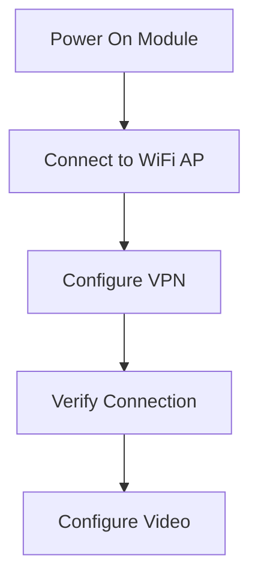
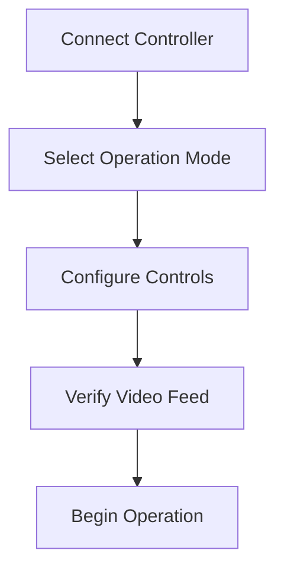
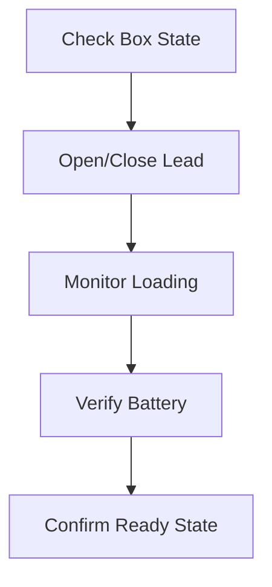

# Product Context: GroundLink (Drone Control System)

## Purpose
GroundLink serves as a comprehensive solution for remote drone operation and management, bridging the gap between manual drone control and automated drone deployment systems. It's designed to enable secure, reliable remote drone operations with integrated video feedback and automated handling capabilities.

## Problems Solved

### Remote Operation Challenges
- Enables secure long-distance drone control through VPN tunneling
- Provides reliable video feedback with configurable quality settings
- Maintains stable control links using TBS Crossfire system
- Handles network inconsistencies and connection recovery

### Automation Requirements
- Integrates with Vulik system for automated drone handling
- Manages drone loading/unloading sequences
- Monitors battery levels and system states
- Provides status feedback for automated operations

### Safety and Security
- Ensures secure communication channels
- Implements failsafe mechanisms
- Monitors system health and connection status
- Provides error handling and recovery procedures

## User Experience Goals

### Operational Experience
1. **Connection Setup**
   - Simple VPN configuration process
   - Automatic network detection and connection
   - Clear connection status indicators
   - Easy troubleshooting steps

2. **Flight Control**
   - Responsive drone control inputs
   - Intuitive joystick mapping
   - Real-time video feedback
   - Clear telemetry data display

3. **Automated Operations**
   - Simple Vulik system interaction
   - Clear status indicators for box and lead states
   - Easy drone loading/unloading control
   - Battery level monitoring

4. **System Management**
   - Easy video quality configuration
   - Simple network settings management
   - Clear system status indicators
   - Accessible diagnostic tools

### Key Workflows

#### Initial Setup

#### Drone Operation

#### Automated Handling

## User Personas

### Remote Operator
- Primary user of flight controls
- Needs clear video feedback
- Requires reliable control response
- Monitors system status

### System Administrator
- Configures network settings
- Manages VPN connections
- Monitors system health
- Handles troubleshooting

### Automation Controller
- Manages Vulik system
- Monitors drone status
- Controls loading/unloading
- Tracks battery levels

## Success Metrics
1. Minimal control latency (< 100ms)
2. Stable video streaming (>15fps at configured quality)
3. Reliable VPN connectivity (>99.9% uptime)
4. Quick system recovery (<30s for reconnection)
5. Clear error reporting and resolution steps

## Expected Outcomes
- Reliable remote drone operations
- Successful automated handling sequences
- Clear system status visibility
- Easy troubleshooting processes
- Satisfied operator experience
