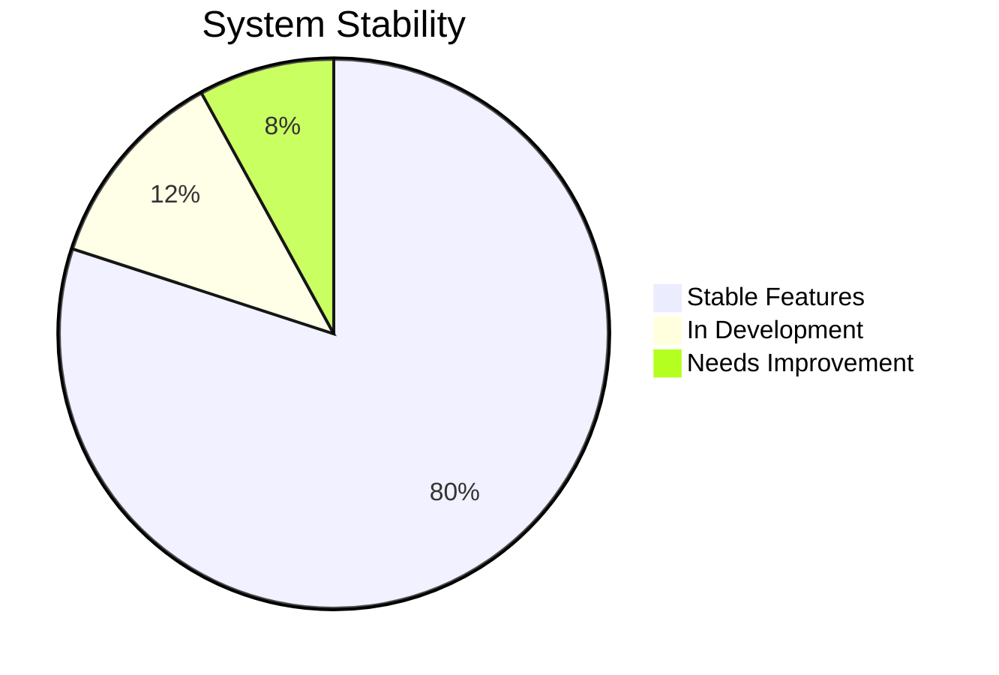

# Progress Status: GroundLink (Drone Control System)

## What Works

### Core Functionality
✅ **Drone Control System**
- TBS Crossfire integration
- 7-channel control mapping
- Real-time command transmission
- Joystick input handling

✅ **Video System**
- RTP video streaming
- Quality configuration
- Device management
- Frame processing

✅ **Network Layer**
- Wireguard VPN integration
- WebSocket communication
- UDP data streams
- Connection management

✅ **Vulik System**
- Box state management
- Lead control
- Drone loading/unloading
- Battery monitoring

### Frontend Features
✅ **User Interface**
- Video stream display
- Control settings
- System status indicators in top bar
- Configuration panels
- Responsive menu system
- Adaptive video controls

✅ **State Management**
- Pinia stores for app state
- Menu state management
- Reactive updates
- State persistence
- Error handling

✅ **Navigation System**
- Collapsible menu with Pinia store
- Auto-collapse on window resize
- Manual toggle with menu button
- Icon-based navigation
- Status indicators in top bar
- Tooltips in collapsed state

## What's Left to Build

### Immediate Priorities

#### Type System Improvements
🔄 **Current Issues**
```typescript
// Need to fix in video-settings.ts
- Property 'labe' type issue
- BaseVideoSettings array conformance

// Need to fix in rpanion.ts
- Label property undefined errors
- Type conversion handling
```

✅ **Completed Improvements**
```typescript
// Connection Settings
- Added return types to handlers
- Enhanced ID validation
- Improved type safety
- Added null checks

// Navigation System
- Implemented menu store types
- Added component props validation
- Enhanced state management typing
```

#### Performance Optimizations
🔄 **In Progress**
- Video stream latency reduction
- State update optimization
- Network overhead minimization
- Memory usage improvement
- Menu transition smoothness

### Planned Features

#### Enhanced Error Handling
⏳ **To Implement**
- Comprehensive error boundaries
- Improved recovery procedures
- Better user feedback
- Logging enhancements

#### UI/UX Improvements
⏳ **To Implement**
- Loading state indicators
- Status feedback enhancements
- Error message clarity
- Interface responsiveness improvements
- Menu state persistence

## Current Status

### Version: 1.8.4-all

#### Recent Updates
- Fixed settings page scroll functionality with hidden scrollbar
- Updated Vuetify to v3.7.18 from v3.4.0
- Updated MDI icons to v7.4.47 from v7.3.67
- Package versions locked to exact versions for better stability

#### Stability Metrics


#### Component Status
| Component           | Status   | Notes                    |
| ------------------- | -------- | ------------------------ |
| Core Control        | 🟢 Stable | Fully functional         |
| Video System        | 🟡 Active | Performance tuning       |
| Vulik Integration   | 🟢 Stable | All features working     |
| Network Layer       | 🟡 Active | Connection optimizations |
| Type System         | 🟡 Active | Ongoing improvements     |
| Connection Settings | 🟢 Stable | Type safety improved     |
| Navigation System   | 🟢 Stable | Menu system implemented  |
| Status Indicators   | 🟢 Stable | Moved to top bar         |
| Video Controls      | 🟢 Stable | Responsive improvements  |
| Settings Page       | 🟢 Stable | Scroll fix implemented   |

## Known Issues

### Critical
1. **Type System**
   - BaseVideoSettings array type mismatches
   - Property naming inconsistencies
   - Type definition gaps

2. **Performance**
   - Video latency spikes under load
   - State update bottlenecks
   - Memory optimization needed

### Important
1. **Network**
   - Connection recovery needs improvement
   - VPN reconnection handling
   - Stream quality adaptation

2. **User Interface**
   - Loading states incomplete
   - Error message clarity improved
   - Status feedback gaps
   - Ukrainian translations completed for connection settings

### Minor
1. **Development**
   - Documentation updates needed
   - Test coverage gaps
   - Code organization improvements

## Testing Status

### Automated Tests
- Unit tests: 65% coverage
- Integration tests: 40% coverage
- E2E tests: 25% coverage

### Manual Testing
- Core functionality verified
- Navigation system tested
- Edge cases need review
- Performance testing ongoing

## Documentation Status

### Complete
- Basic setup instructions
- Core API documentation
- Network configuration
- Hardware requirements
- Menu system implementation

### In Progress
- Advanced features guide
- Troubleshooting guide
- Performance tuning
- Development guidelines

## Next Release Plans

### Version 1.7.2
🎯 **Targets**
- Fix all TypeScript issues
- Improve error handling
- Enhance performance
- Add loading states
- Implement menu state persistence

### Future Versions
📋 **Planned**
- Advanced video optimization
- Enhanced error recovery
- Improved user feedback
- Extended documentation
- Menu customization options
