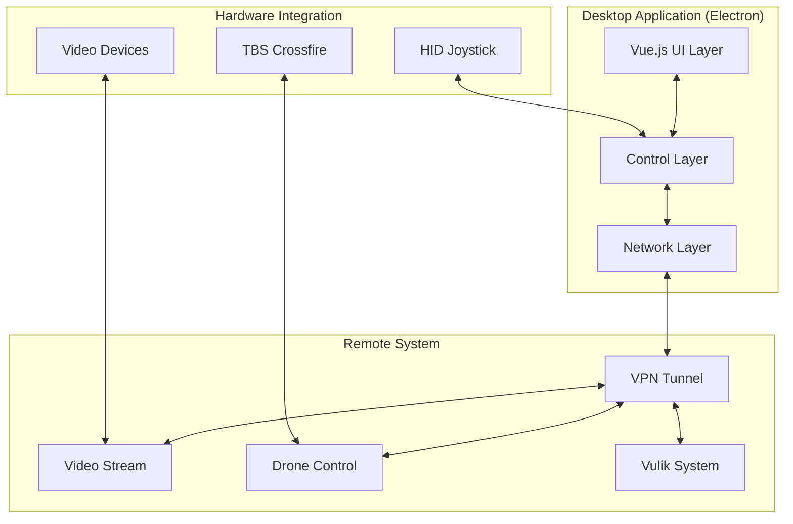
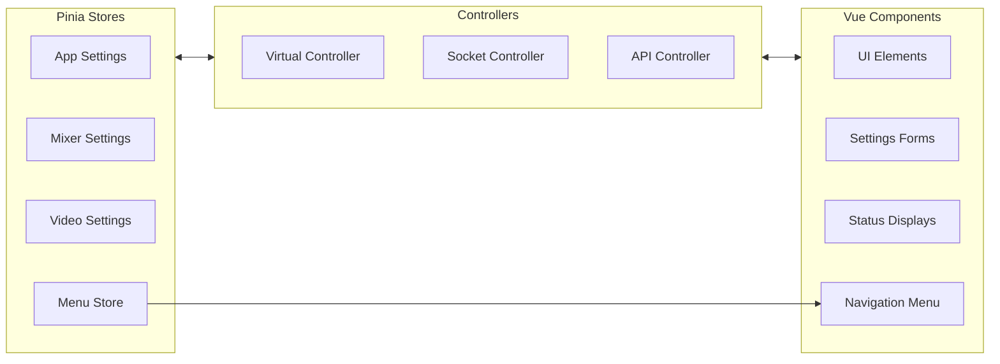
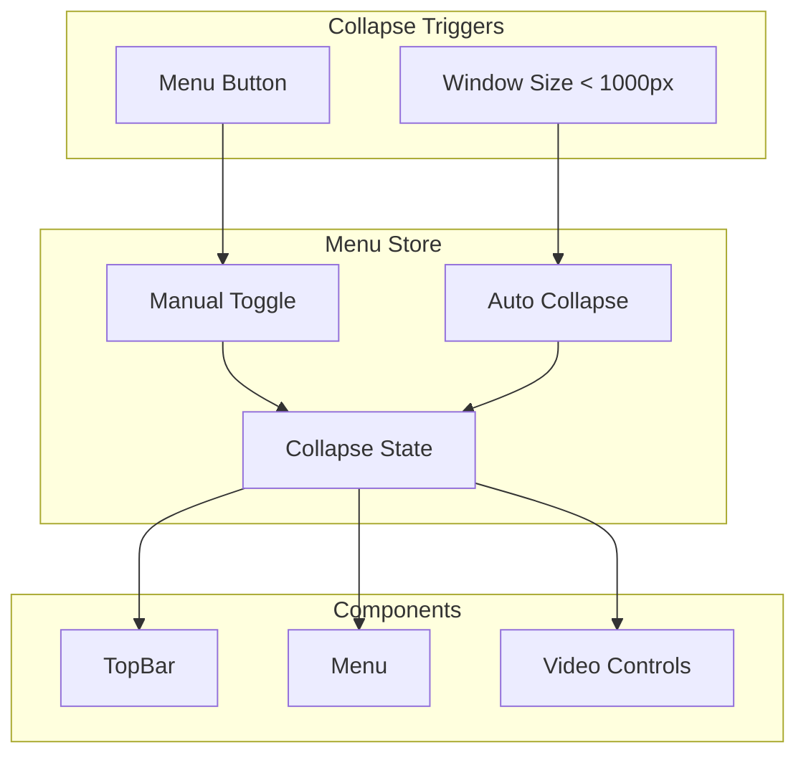
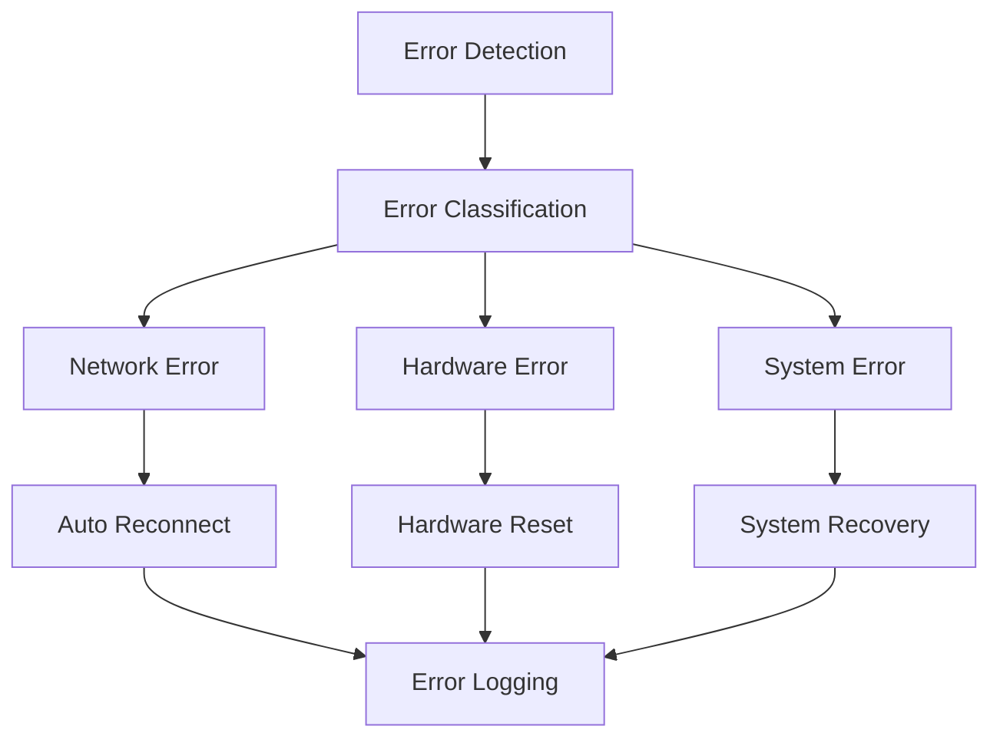
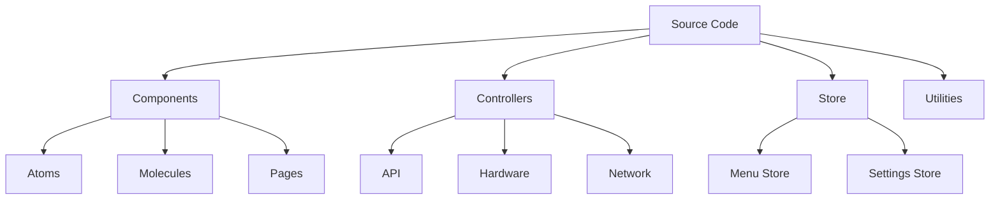

# System Patterns: GroundLink (Drone Control System)

## System Architecture

### High-Level Architecture

## Core Components

### Frontend Layer
- **Vue 3 Components**
  - Reactive UI updates
  - Component-based architecture
  - Vuetify for UI components
  - Vue Router for navigation
  - Pinia for state management

### Control Layer
- **Drone Control**
  - Channel mapping system
  - Joystick input processing
  - Real-time command transmission
  - Telemetry data handling

- **Video Management**
  - RTP stream handling
  - Quality configuration
  - Device management
  - Frame processing

- **Vulik Integration**
  - Box state management
  - Lead control system
  - Drone loading/unloading
  - Battery monitoring

### Network Layer
- **VPN Management**
  - Wireguard configuration
  - Connection monitoring
  - Auto-reconnection
  - Status tracking

- **Data Streams**
  - Control commands (UDP)
  - Video streaming (RTP)
  - Telemetry data
  - System status updates

## Design Patterns

### State Management

### Navigation Pattern

### Communication Patterns
1. **WebSocket Communication**
   - Real-time control data
   - Status updates
   - Error reporting

2. **REST APIs**
   - Configuration management
   - System status queries
   - Command transmission

3. **UDP Streams**
   - Video transmission
   - Telemetry data
   - Control commands

### Error Handling

## Technical Decisions

### Framework Choices
- **Electron**: Cross-platform desktop support
- **Vue 3**: Modern reactive UI framework
- **TypeScript**: Type safety and better development experience
- **Vuetify**: Material Design component framework

### Communication Protocols
- **Wireguard VPN**: Secure tunnel for all communications
- **RTP**: Efficient video streaming
- **WebSocket**: Real-time control and status
- **UDP**: Low-latency data transmission

### Hardware Integration
- **HID Protocol**: Joystick input handling
- **TBS Crossfire**: Reliable drone control
- **Video Devices**: Multiple format support
- **Vulik System**: Automated handling interface

### UI/UX Patterns
- **Responsive Navigation**
  - Collapsible menu system
  - Status indicators in top bar
  - Adaptive video controls
  - Icon-based navigation in collapsed state
  - Tooltips for accessibility

## Development Patterns

### Code Organization

### Best Practices
1. **Component Design**
   - Single responsibility
   - Reusable components
   - Props validation
   - Event handling

2. **State Management**
   - Centralized stores
   - Action/mutation patterns
   - Reactive updates
   - State persistence

3. **Error Handling**
   - Error boundaries
   - Graceful degradation
   - User feedback
   - Recovery procedures
